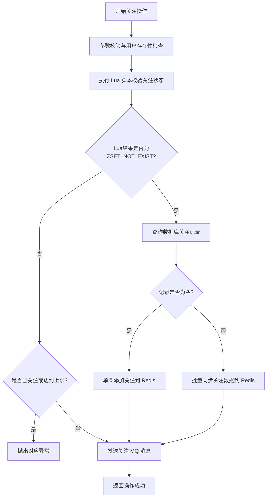
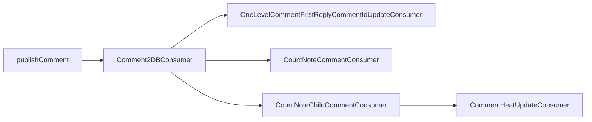



@[TOC]
# framework - 平台基础设施

## starter - jackson
为了支持 Java 8 中新的日期 API ，我们需要自定义 Jackson 配置 

```java
@AutoConfiguration
public class JacksonAutoConfiguration {

    @Bean
    public ObjectMapper objectMapper() {
        // 初始化一个 ObjectMapper 对象，用于自定义 Jackson 的行为
        ObjectMapper objectMapper = new ObjectMapper();

        // 忽略未知属性
        objectMapper.configure(DeserializationFeature.FAIL_ON_UNKNOWN_PROPERTIES, false);
        objectMapper.configure(SerializationFeature.FAIL_ON_EMPTY_BEANS, false);
        // 设置凡是为 null 的字段，返参中均不返回，请根据项目组约定是否开启
        // objectMapper.setSerializationInclusion(JsonInclude.Include.NON_NULL);

        // 设置时区
        objectMapper.setTimeZone(TimeZone.getTimeZone("Asia/Shanghai"));

        // JavaTimeModule 用于指定序列化和反序列化规则
        JavaTimeModule javaTimeModule = new JavaTimeModule();

        // 支持 LocalDateTime、LocalDate、LocalTime
        javaTimeModule.addSerializer(LocalDateTime.class, new LocalDateTimeSerializer(DateConstants.DATE_FORMAT_Y_M_D_H_M_S));
        javaTimeModule.addDeserializer(LocalDateTime.class, new LocalDateTimeDeserializer(DateConstants.DATE_FORMAT_Y_M_D_H_M_S));
        javaTimeModule.addSerializer(LocalDate.class, new LocalDateSerializer(DateConstants.DATE_FORMAT_Y_M_D));
        javaTimeModule.addDeserializer(LocalDate.class, new LocalDateDeserializer(DateConstants.DATE_FORMAT_Y_M_D));
        javaTimeModule.addSerializer(LocalTime.class, new LocalTimeSerializer(DateConstants.DATE_FORMAT_H_M_S));
        javaTimeModule.addDeserializer(LocalTime.class, new LocalTimeDeserializer(DateConstants.DATE_FORMAT_H_M_S));
        // 支持 YearMonth
        javaTimeModule.addSerializer(YearMonth.class, new YearMonthSerializer(DateConstants.DATE_FORMAT_Y_M));
        javaTimeModule.addDeserializer(YearMonth.class, new YearMonthDeserializer(DateConstants.DATE_FORMAT_Y_M));

        objectMapper.registerModule(javaTimeModule);

        // 初始化 JsonUtils 中的 ObjectMapper
        JsonUtils.init(objectMapper);

        return objectMapper;
    }

}
```
starter 自动配置，**重中之重** ，当引入这个组件时，这个类会自动运行，并注册 Bean

需要严格按照此格式书写
## common
### exception
```java
public interface BaseExceptionInterface {
    
    String getErrorCode();

    String getErrorMessage();
}
```
这个接口用来规范错误信息的格式，可以使用枚举类来继承它
eq:
```java
@AllArgsConstructor
@Getter
public enum ResponseCodeEnum implements BaseExceptionInterface {

    // ----------- 通用异常状态码 -----------
    SYSTEM_ERROR("COMMENT-10000", "出错啦，后台小哥正在努力修复中..."),
    PARAM_NOT_VALID("COMMENT-10001", "参数错误"),
    COMMENT_NOT_FOUND("COMMENT-20001", "此评论不存在"),

    // ----------- 业务异常状态码 -----------
    ;

    // 异常码
    private final String errorCode;
    // 错误信息
    private final String errorMessage;
}
```

```java
@Getter
@Setter
public class BizException extends RuntimeException {
    // 异常码
    private String errorCode;
    // 错误信息
    private String errorMessage;

    public BizException(BaseExceptionInterface baseExceptionInterface) {
        this.errorCode = baseExceptionInterface.getErrorCode();
        this.errorMessage = baseExceptionInterface.getErrorMessage();
    }
}
```
BizException 继承 RuntimeException ，意味着当系统内部出现错误或者用户操作不规范，系统会捕获该异常，并将其返回给前端
eq:
当我们主动抛出异常
```java
throw new BizException(ResponseCodeEnum.USER_NOT_FOUND);
```
```java
@ControllerAdvice
@Slf4j
public class GlobalExceptionHandler {

    /**
     * 捕获自定义业务异常
     * @return
     */
    @ExceptionHandler({ BizException.class })
    @ResponseBody
    public Response<Object> handleBizException(HttpServletRequest request, BizException e) {
        log.warn("{} request fail, errorCode: {}, errorMessage: {}", request.getRequestURI(), e.getErrorCode(), e.getErrorMessage());
        return Response.fail(e);
    }

    /**
     * 捕获参数校验异常
     * @return
     */
    @ExceptionHandler({ MethodArgumentNotValidException.class })
    @ResponseBody
    public Response<Object> handleMethodArgumentNotValidException(HttpServletRequest request, MethodArgumentNotValidException e) {
        // 参数错误异常码
        String errorCode = ResponseCodeEnum.PARAM_NOT_VALID.getErrorCode();

        // 获取 BindingResult
        BindingResult bindingResult = e.getBindingResult();

        StringBuilder sb = new StringBuilder();

        // 获取校验不通过的字段，并组合错误信息，格式为： email 邮箱格式不正确, 当前值: '123124qq.com';
        Optional.ofNullable(bindingResult.getFieldErrors()).ifPresent(errors -> {
            errors.forEach(error ->
                    sb.append(error.getField())
                            .append(" ")
                            .append(error.getDefaultMessage())
                            .append(", 当前值: '")
                            .append(error.getRejectedValue())
                            .append("'; ")

            );
        });

        // 错误信息
        String errorMessage = sb.toString();

        log.warn("{} request error, errorCode: {}, errorMessage: {}", request.getRequestURI(), errorCode, errorMessage);

        return Response.fail(errorCode, errorMessage);
    }

    /**
     * 捕获 guava 参数校验异常
     * @return
     */
    @ExceptionHandler({ IllegalArgumentException.class })
    @ResponseBody
    public Response<Object> handleIllegalArgumentException(HttpServletRequest request, IllegalArgumentException e) {
        // 参数错误异常码
        String errorCode = ResponseCodeEnum.PARAM_NOT_VALID.getErrorCode();

        // 错误信息
        String errorMessage = e.getMessage();

        log.warn("{} request error, errorCode: {}, errorMessage: {}", request.getRequestURI(), errorCode, errorMessage);

        return Response.fail(errorCode, errorMessage);
    }

    /**
     * 其他类型异常
     * @param request
     * @param e
     * @return
     */
    @ExceptionHandler({ Exception.class })
    @ResponseBody
    public Response<Object> handleOtherException(HttpServletRequest request, Exception e) {
        log.error("{} request error, ", request.getRequestURI(), e);
        return Response.fail(ResponseCodeEnum.SYSTEM_ERROR);
    }
}

```
这个类的第一个方法就会触发，捕获 BizException 异常

### response
```java
@Data
public class Response<T> implements Serializable {

    // 是否成功，默认为 true
    private boolean success = true;
    // 响应消息
    private String message;
    // 异常码
    private String errorCode;
    // 响应数据
    private T data;

    // =================================== 成功响应 ===================================
    public static <T> Response<T> success() {
        Response<T> response = new Response<>();
        return response;
    }

    public static <T> Response<T> success(T data) {
        Response<T> response = new Response<>();
        response.setData(data);
        return response;
    }

    // =================================== 失败响应 ===================================
    public static <T> Response<T> fail() {
        Response<T> response = new Response<>();
        response.setSuccess(false);
        return response;
    }

    public static <T> Response<T> fail(String errorMessage) {
        Response<T> response = new Response<>();
        response.setSuccess(false);
        response.setMessage(errorMessage);
        return response;
    }

    public static <T> Response<T> fail(String errorCode, String errorMessage) {
        Response<T> response = new Response<>();
        response.setSuccess(false);
        response.setErrorCode(errorCode);
        response.setMessage(errorMessage);
        return response;
    }

    public static <T> Response<T> fail(BizException bizException) {
        Response<T> response = new Response<>();
        response.setSuccess(false);
        response.setErrorCode(bizException.getErrorCode());
        response.setMessage(bizException.getErrorMessage());
        return response;
    }

    public static <T> Response<T> fail(BaseExceptionInterface baseExceptionInterface) {
        Response<T> response = new Response<>();
        response.setSuccess(false);
        response.setErrorCode(baseExceptionInterface.getErrorCode());
        response.setMessage(baseExceptionInterface.getErrorMessage());
        return response;
    }

}
```
这个类用来规范数据返回前端的格式

```java
@Data
public class PageResponse<T> extends Response<List<T>> {

    // 当前页码
    private long pageNo;
    // 总数据量
    private long totalCount;
    // 每页展示的数据量
    private long pageSize;
    // 总页数
    private long totalPage;


    public static <T> PageResponse<T> success(List<T> data, long pageNo, long totalCount) {
        PageResponse<T> pageResponse = new PageResponse<>();
        pageResponse.setSuccess(true);
        pageResponse.setData(data);
        pageResponse.setPageNo(pageNo);
        pageResponse.setTotalCount(totalCount);
        // 每页展示的数据量
        long pageSize = 10L;
        pageResponse.setPageSize(pageSize);
        // 计算总页数
        long totalPage = (totalCount + pageSize - 1) / pageSize;
        pageResponse.setTotalPage(totalPage);
        return pageResponse;
    }


    public static <T> PageResponse<T> success(List<T> data, long pageNo, long totalCount, long pageSize) {
        PageResponse<T> pageResponse = new PageResponse<>();
        pageResponse.setSuccess(true);
        pageResponse.setData(data);
        pageResponse.setPageNo(pageNo);
        pageResponse.setTotalCount(totalCount);
        pageResponse.setPageSize(pageSize);
        // 计算总页数
        long totalPage = pageSize == 0 ? 0 : (totalCount + pageSize - 1) / pageSize;
        pageResponse.setTotalPage(totalPage);
        return pageResponse;
    }

    /**
     * 获取总页数
     */
    public static long getTotalPage(long totalCount, long pageSize) {

        return pageSize == 0 ? 0 : (totalCount + pageSize - 1) / pageSize;
    }

    /**
     * 计算分页查询的 offset
     */
    public static long getOffset(long pageNo, long pageSize) {
        // 如果页码小于 1，默认返回第一页的 offset
        if (pageNo < 1) {
            pageNo = 1;
        }
        return (pageNo - 1) * pageSize;
    }
}
```
这个类是用来规范数组类型的数据的返回格式

### util
```java
public class JsonUtils {

    private static ObjectMapper OBJECT_MAPPER = new ObjectMapper();

    static {
        OBJECT_MAPPER.configure(DeserializationFeature.FAIL_ON_UNKNOWN_PROPERTIES, false);
        OBJECT_MAPPER.configure(SerializationFeature.FAIL_ON_EMPTY_BEANS, false);
        OBJECT_MAPPER.registerModules(new JavaTimeModule()); // 解决 LocalDateTime 的序列化问题
    }

    /**
     * 初始化：统一使用 Spring Boot 个性化配置的 ObjectMapper
     */
    public static void init(ObjectMapper objectMapper) {
        OBJECT_MAPPER = objectMapper;
    }

    /**
     *  将对象转换为 JSON 字符串
     */
    @SneakyThrows
    public static String toJsonString(Object obj) {
       return OBJECT_MAPPER.writeValueAsString(obj);
    }

    /**
     * 将 JSON 字符串转换为对象
     */
    @SneakyThrows
    public static <T> T parseObject(String jsonStr, Class<T> clazz) {
        if (StringUtils.isBlank(jsonStr)) {
            return null;
        }

        return OBJECT_MAPPER.readValue(jsonStr, clazz);
    }

    /**
     * 将 JSON 字符串转换为 Map
     */
    public static <K, V> Map<K, V> parseMap(String jsonStr, Class<K> keyClass, Class<V> valueClass) throws Exception {
        // 创建 TypeReference，指定泛型类型
        TypeReference<Map<K, V>> typeRef = new TypeReference<Map<K, V>>() {
        };

        // 将 JSON 字符串转换为 Map
        return OBJECT_MAPPER.readValue(jsonStr, OBJECT_MAPPER.getTypeFactory().constructMapType(Map.class, keyClass, valueClass));
    }

    /**
     * 将 JSON 字符串解析为指定类型的 List 对象
     */
    public static <T> List<T> parseList(String jsonStr, Class<T> clazz) throws Exception {
        // 使用 TypeReference 指定 List<T> 的泛型类型
        return OBJECT_MAPPER.readValue(jsonStr, new TypeReference<>() {
            @Override
            public CollectionType getType() {
                return OBJECT_MAPPER.getTypeFactory().constructCollectionType(List.class, clazz);
            }
        });
    }

    /**
     * 将 JSON 字符串解析为指定类型的 Set 对象
     */
    public static <T> Set<T> parseSet(String jsonStr, Class<T> clazz) throws Exception {

        return OBJECT_MAPPER.readValue(jsonStr, new TypeReference<>() {
            @Override
            public Type getType() {
                return OBJECT_MAPPER.getTypeFactory().constructCollectionType(Set.class, clazz);
            }
        });
    }
}
```
序列化与反序列化使用的是 Jackson

## starter - content 全局上下文
在单体项目中，使用 ThreadLocal 就可以满足要求，但在微服务项目，存在微服务间调用的问题，这时 ThreadLocal 就不能保证全局上下文，需要放置拦截器，将信息放在请求头中，保证透传
当一个微服务调用另一个微服务时，会触发这个类，将 USER_ID 设置到请求头中
```java
@Slf4j
public class FeignRequestInterceptor implements RequestInterceptor {
    @Override
    public void apply(RequestTemplate requestTemplate) {
        Long userId = LoginUserContextHolder.getUserId();
        if (Objects.nonNull(userId)) {
            requestTemplate.header(GlobalConstants.USER_ID, String.valueOf(userId));
            log.info("########## feign 请求设置请求头 userId: {}", userId);
        }
    }
}
```
过滤器，设置上下文，请求返回时删除上下文
```java
@Slf4j
public class HeaderUserId2ContextFilter extends OncePerRequestFilter {

    @Override
    protected void doFilterInternal(HttpServletRequest request, HttpServletResponse response,
                                    FilterChain chain) throws ServletException, IOException {
        // 从请求头中获取用户 ID
        String userId = request.getHeader(GlobalConstants.USER_ID);

        // 判断请求头中是否存在用户 ID
        if (StringUtils.isBlank(userId)) {
            // 若为空，则直接放行
            chain.doFilter(request, response);
            return;
        }

        log.info("===== 设置 userId 到 ThreadLocal 中， 用户 ID: {}", userId);
        LoginUserContextHolder.setUserId(userId);

        try {
            chain.doFilter(request, response);
        } finally {
            // 一定要删除 ThreadLocal ，防止内存泄露
            LoginUserContextHolder.remove();
            log.info("===== 删除 ThreadLocal， userId: {}", userId);
        }
    }
}
```
上下文
```java
public class LoginUserContextHolder {

    // 初始化一个 ThreadLocal 变量
    private static final ThreadLocal<Map<String, Object>> LOGIN_USER_CONTEXT_THREAD_LOCAL
            = TransmittableThreadLocal.withInitial(HashMap::new);
	......
}

```

引入这个组件时，确保这个组件的 Bean 全部注册成功


## distributed - id - generate - 分布式 Id
使用的是美团的 Leaf
### Snowflake - 基于雪花算法生成 Id
核心方法
```java
    public synchronized Result get(String key) {
        long timestamp = timeGen();
        if (timestamp < lastTimestamp) {
            long offset = lastTimestamp - timestamp;
            if (offset <= 5) {
                try {
                    wait(offset << 1);
                    timestamp = timeGen();
                    if (timestamp < lastTimestamp) {
                        return new Result(-1, Status.EXCEPTION);
                    }
                } catch (InterruptedException e) {
                    LOGGER.error("wait interrupted");
                    return new Result(-2, Status.EXCEPTION);
                }
            } else {
                return new Result(-3, Status.EXCEPTION);
            }
        }
        if (lastTimestamp == timestamp) {
            sequence = (sequence + 1) & sequenceMask;
            if (sequence == 0) {
                //seq 为0的时候表示是下一毫秒时间开始对seq做随机
                sequence = RANDOM.nextInt(100);
                timestamp = tilNextMillis(lastTimestamp);
            }
        } else {
            //如果是新的ms开始
            sequence = RANDOM.nextInt(100);
        }
        lastTimestamp = timestamp;
        long id = ((timestamp - twepoch) << timestampLeftShift) | (workerId << workerIdShift) | sequence;
        return new Result(id, Status.SUCCESS);

    }
```
1. 获取当前时间戳：
* 若时间回退（当前时间戳小于上次生成 ID 的时间戳）：
	* 小范围回退（≤5ms）：等待双倍时间后重试。
	* 大范围回退：直接返回异常。
* 若时间正常：
	* 同一毫秒内：序列号递增（通过 sequenceMask 取模）。
	* 若序列号溢出（变为 0）：等待下一毫秒，并生成随机序列号（0-99）。
不同毫秒：重置序列号为随机数（0-99）。
2. 组合生成 ID：

```plaintext
ID = (时间戳差值 << 22) | (工作机器 ID << 12) | 序列号
```
* 时间戳差值：当前时间减去基准时间。
* 工作机器 ID：通过 ZooKeeper 生成唯一标识生成节点。
* 序列号：同一毫秒内的唯一计数。

### Segment - 基于分段式生成 Id

核心方法
```java
    public Result get(final String key) {
        if (!initOK) {
            return new Result(EXCEPTION_ID_IDCACHE_INIT_FALSE, Status.EXCEPTION);
        }
        if (cache.containsKey(key)) {
            SegmentBuffer buffer = cache.get(key);
            if (!buffer.isInitOk()) {
            	// 重入锁
                synchronized (buffer) {
                    if (!buffer.isInitOk()) {
                        try {
                            updateSegmentFromDb(key, buffer.getCurrent());
                            logger.info("Init buffer. Update leafkey {} {} from db", key, buffer.getCurrent());
                            buffer.setInitOk(true);
                        } catch (Exception e) {
                            logger.warn("Init buffer {} exception", buffer.getCurrent(), e);
                        }
                    }
                }
            }
            		// 获取 id
            return getIdFromSegmentBuffer(cache.get(key));
        }
        return new Result(EXCEPTION_ID_KEY_NOT_EXISTS, Status.EXCEPTION);
    }
```
ID 生成过程采用 "双缓冲区 + 预加载" 模式，核心步骤如下：

1. 检查缓存初始化状态，未初始化则返回异常
2. 根据业务 key 获取对应的 SegmentBuffer
3. 从 SegmentBuffer 中获取可用 ID 段，采用读写锁保证线程安全
4. 当当前 Segment 即将耗尽时，异步预加载下一个 Segment

```java
    public Result getIdFromSegmentBuffer(final SegmentBuffer buffer) {
        while (true) {
            buffer.rLock().lock();
            try {
                final Segment segment = buffer.getCurrent();
                if (!buffer.isNextReady() && (segment.getIdle() < 0.9 * segment.getStep()) && buffer.getThreadRunning().compareAndSet(false, true)) {
                    service.execute(new Runnable() {
                        @Override
                        public void run() {
                            Segment next = buffer.getSegments()[buffer.nextPos()];
                            boolean updateOk = false;
                            try {
                                updateSegmentFromDb(buffer.getKey(), next);
                                updateOk = true;
                                logger.info("update segment {} from db {}", buffer.getKey(), next);
                            } catch (Exception e) {
                                logger.warn(buffer.getKey() + " updateSegmentFromDb exception", e);
                            } finally {
                                if (updateOk) {
                                    buffer.wLock().lock();
                                    buffer.setNextReady(true);
                                    buffer.getThreadRunning().set(false);
                                    buffer.wLock().unlock();
                                } else {
                                    buffer.getThreadRunning().set(false);
                                }
                            }
                        }
                    });
                }
                long value = segment.getValue().getAndIncrement();
                if (value < segment.getMax()) {
                    return new Result(value, Status.SUCCESS);
                }
            } finally {
                buffer.rLock().unlock();
            }
            waitAndSleep(buffer);
            buffer.wLock().lock();
            try {
                final Segment segment = buffer.getCurrent();
                long value = segment.getValue().getAndIncrement();
                if (value < segment.getMax()) {
                    return new Result(value, Status.SUCCESS);
                }
                if (buffer.isNextReady()) {
                    buffer.switchPos();
                    buffer.setNextReady(false);
                } else {
                    logger.error("Both two segments in {} are not ready!", buffer);
                    return new Result(EXCEPTION_ID_TWO_SEGMENTS_ARE_NULL, Status.EXCEPTION);
                }
            } finally {
                buffer.wLock().unlock();
            }
        }
    }
```

采用双缓冲区设计：

1. 两个 Segment 交替使用：currentSegment 和 nextSegment
2. 预加载机制：当 currentSegment 使用量超过 90% 时，异步加载 nextSegment
3. 读写锁分离：使用 ReentrantReadWriteLock 实现读写并发

# OSS - 对象存储
策略模式 + 工厂模式管理 Minio 和 AliyunOSS 实现实现文件处理可扩展
当文件上传成功后，会返回一个 URL，访问这个 URL 就可以获取这个文件

# KV - 短文本存储
这个项目涉及短文本存储的地方主要有两个：笔记、评论

采用 Cassandra 存储短文本

## 笔记
笔记的表
```cql
CREATE TABLE note_content (
    id UUID PRIMARY KEY,
    content TEXT
);
```

```java
@Table("note_content")
@Data
@AllArgsConstructor
@NoArgsConstructor
@Builder
public class NoteContentDO {

    @PrimaryKey("id")
    private UUID id;

    private String content;
}

public interface NoteContentRepository extends CassandraRepository<NoteContentDO, UUID> {
}
```
* CassandraRepository: 这是 Spring Data Cassandra 提供的一个泛型接口，它为 Cassandra 数据库提供了 CRUD（创建、读取、更新、删除）和其他一些基本的操作方法。
* <NoteContentDO, UUID>: 这里有两个类型参数：
	* NoteContentDO: 表示与 Cassandra 数据库交互时使用的数据对象类型。通常情况下，这是一个 Java 类，它映射到数据库中的表。
	* UUID: 表示 NoteContentDO 对象的主键类型。根据表的实际情况来定义，这里使用 UUID 作为主键类型。

插入笔记：
```java
    @Resource
    private NoteContentRepository noteContentRepository;

    @Override
    public Response<?> addNoteContent(AddNoteContentReqDTO addNoteContentReqDTO) {

        String content = addNoteContentReqDTO.getContent();

        NoteContentDO noteContentDO = new NoteContentDO(UUID.fromString(addNoteContentReqDTO.getUuid()), content);
        noteContentRepository.save(noteContentDO);

        return Response.success(noteContentDO);
    }
```
## 评论
评论的表
```cql
CREATE TABLE comment_content (
    note_id BIGINT, -- 笔记 ID，分区键
    year_month TEXT, -- 发布年月
    content_id UUID, -- 评论内容 ID
    content TEXT,
    PRIMARY KEY ((note_id, year_month), content_id)
);
```
1.  复合分区键 (note_id, year_month):
* 分区键的作用：在 Cassandra中，分区键决定了数据存储的位置，即哪个节点将保存该数据。通过使用复合分区键，可以更灵活地控制数据分布。
* 为什么选择这两个字段：
	* note_id：笔记 ID, 作为笔记的唯一标识符，让它成为分区键的一部分，因为评论查询，是基于某篇笔记进行。
	* year_month：加入发布年月是为了避免单个分区变得过大。如果仅以 note_id 作为分区键，那么所有该笔记的评论都将存储在一个分区里，可能导致热点问题（hotspotting），即某些分区的数据量远大于其他分区，影响性能。通过引入时间维度，可以将数据分散到多个分区中，有助于提高读写性能和负载均衡。
2. 聚簇列 (content_id):
* 在 Cassandra 中，主键由分区键和聚簇列组成。这里 content_id 作为聚簇列，确保了在同一 note_id 和 year_month 下，并且每个评论内容具有唯一性。UUID 类型非常适合用作这样的唯一标识符，因为它能够保证全局唯一性，即使是在分布式环境中。


# user - 用户服务
主要的接口：
```java
@RestController
@RequestMapping("/user")
@Slf4j
public class UserController {

    @Resource
    private UserService userService;

    /**
     * 用户信息修改
     */
    @PostMapping(value = "/update", consumes = MediaType.MULTIPART_FORM_DATA_VALUE)
    public Response<?> updateUserInfo(@Validated UpdateUserInfoReqVO updateUserInfoReqVO) {
        userService.updateUserInfo(updateUserInfoReqVO);
        return Response.success();
    }

    // ===================================== 对其他服务提供的接口 =====================================
    @PostMapping("/register")
    public Response<?> register(@RequestBody RegisterUserReqDTO registerUserReqDTO) {
        return userService.register(registerUserReqDTO);
    }

    @PostMapping("/findByPhone")
    @ApiOperationLog(description = "手机号查询用户信息")
    public Response<FindUserByPhoneRspDTO> findByPhone(@Validated @RequestBody FindUserByPhoneReqDTO findUserByPhoneReqDTO) {
        return userService.findByPhone(findUserByPhoneReqDTO);
    }

    @PostMapping("/password/update")
    @ApiOperationLog(description = "更新密码")
    public Response<?> updatePassword(@Validated @RequestBody UpdateUserPasswordReqDTO updateUserPasswordReqDTO) {
        return userService.updatePassword(updateUserPasswordReqDTO);
    }

    @PostMapping("/findById")
    @ApiOperationLog(description = "根据用户 id 查询用户信息")
    public Response<FindUserByIdRspDTO> findById(@Validated @RequestBody FindUserByIdReqDTO findUserByIdReqDTO) {
        return userService.findById(findUserByIdReqDTO);
    }

    @PostMapping("/findByIds")
    @ApiOperationLog(description = "批量查询用户信息")
    public Response<List<FindUserByIdRspDTO>> findByIds(@Validated @RequestBody FindUsersByIdsReqDTO findUsersByIdsReqDTO) {
        return userService.findByIds(findUsersByIdsReqDTO);
    }
}

```

这个项目提供的注册方式手机验证码，当尝试通过手机号注册时，会先检查数据库，如果存储则返回原有账户，如果不存在则新加一个账户插入到数据库中，用户的 Id，是由上文提到的分布式 id 服务生成的

这个项目使用 RBAC 0 来进行鉴权设计

用户与角色之间，角色与权限之前是多对多的关系


```sql
CREATE TABLE `t_permission` (
  `id` bigint unsigned NOT NULL AUTO_INCREMENT COMMENT '主键ID',
  `parent_id` bigint unsigned NOT NULL DEFAULT '0' COMMENT '父ID',
  `name` varchar(16) COLLATE utf8mb4_unicode_ci NOT NULL COMMENT '权限名称',
  `type` tinyint unsigned NOT NULL COMMENT '类型(1：目录 2：菜单 3：按钮)',
  `menu_url` varchar(32) COLLATE utf8mb4_unicode_ci NOT NULL DEFAULT '' COMMENT '菜单路由',
  `menu_icon` varchar(255) COLLATE utf8mb4_unicode_ci NOT NULL DEFAULT '' COMMENT '菜单图标',
  `sort` int unsigned NOT NULL DEFAULT 0 COMMENT '管理系统中的显示顺序',
  `permission_key` varchar(64) COLLATE utf8mb4_unicode_ci NOT NULL COMMENT '权限标识',
  `status` tinyint unsigned NOT NULL DEFAULT '0' COMMENT '状态(0：启用；1：禁用)',
  `create_time` datetime NOT NULL DEFAULT CURRENT_TIMESTAMP COMMENT '创建时间',
  `update_time` datetime NOT NULL DEFAULT CURRENT_TIMESTAMP COMMENT '更新时间',
  `is_deleted` bit(1) NOT NULL DEFAULT b'0' COMMENT '逻辑删除(0：未删除 1：已删除)',
  PRIMARY KEY (`id`) USING BTREE
) ENGINE=InnoDB DEFAULT CHARSET=utf8mb4 COLLATE=utf8mb4_unicode_ci COMMENT='权限表';

```
其中的权限表示设计有点类似与目录的结构

用户在注册成功后，默认设置为普通用户，并将用户的角色缓存在 redis 中，供后续网关鉴权使用

在通过用户 id 查找用户时，设置了二级缓存，当本地缓存找不到时，会从 redis 找，如果 redis 找不到，会查询数据库，并将结果缓存到 redis 中

用户服务还有一个职责是在 **用户服务项目启动时** 将 **角色 - 权限集合数据** 同步到 redis 中，为了确保多个用户服务不会重复同步将角色 - 权限集合数据，可以使用 redis 分布式锁
分布式锁是确保在分布式系统中多个节点能够协调一致地访问共享资源的一种机制。Redis 分布式锁通过 Redis 的原子操作，确保在高并发情况下，对共享资源的访问是互斥的。
**实现思路：**

* 可以使用 Redis 的 SETNX 命令来实现。如果键不存在，则设置键值并返回 1（表示加锁成功）；如果键已存在，则返回 0（表示加锁失败）。
* 多个子服务同时操作 Redis , 第一个加锁成功，则可以同步权限数据；后续的子服务都会加锁失败，若加锁失败，则不同步权限数据；
* 另外，结合 EXPIRE 命令为锁设置一个过期时间，比如 1 天，防止死锁。则在 1 天内，无论启动多少次认证服务，均只会同步一次数据。


# user-relation 用户关系服务
```java
@RestController
@RequestMapping("/relation")
@Slf4j
public class RelationController {

    @Resource
    private RelationService relationService;

    @PostMapping("/follow")
    @ApiOperationLog(description = "关注用户")
    public Response<?> follow(@Validated @RequestBody FollowUserReqVO followUserReqVO) {
        return relationService.follow(followUserReqVO);
    }

    @PostMapping("/unfollow")
    @ApiOperationLog(description = "取关用户")
    public Response<?> unfollow(@Validated @RequestBody UnfollowUserReqVO unfollowUserReqVO) {
        return relationService.unfollow(unfollowUserReqVO);
    }

    @PostMapping("/follow/list")
    @ApiOperationLog(description = "查询用户关注列表")
    public PageResponse<FindFollowingUserRspVO> findFollowingLst(@Validated @RequestBody FindFollowingListReqVO findFollowingListReqVO) {
        return relationService.findFollowingList(findFollowingListReqVO);
    }

    @PostMapping("/fans/list")
    @ApiOperationLog(description = "查询用户粉丝列表")
    public PageResponse<FindFansUserRspVO> findFansList(@Validated @RequestBody FindFansListReqVO findFansListReqVO) {
        return relationService.findFansList(findFansListReqVO);
    }
}

```
用户关系服务主要有 4 个功能：关注、取关、查看用户关注列表、查看用户粉丝列表

有两张表：一张关注表、一张粉丝表


**关注方法:**


1. 基础参数校验
* 获取用户 ID：从上下文中获取当前登录用户 ID（userId）和被关注用户 ID（followUserId）。
* 自我关注校验：若两者相等，抛出CANT_FOLLOW_YOUR_SELF异常，禁止用户关注自己。
* 用户存在性校验：通过userRpcService远程调用检查被关注用户是否存在，不存在则抛出FOLLOW_USER_NOT_EXISTED异常。

2. Redis 缓存操作（核心逻辑）
* 构建 Redis Key：使用RedisKeyConstants.buildUserFollowingKey(userId)生成用户关注列表的 Redis 键。
* 执行 Lua 脚本校验关注状态：
	* 加载follow_check_and_add.lua脚本，传入 Redis 键、被关注用户 ID 和当前时间戳。
	* 脚本返回结果通过LuaResultEnum枚举解析，可能的状态包括：
		* FOLLOW_LIMIT：关注数达到上限，抛出FOLLOWING_COUNT_LIMIT异常。
		* ALREADY_FOLLOWED：已关注该用户，抛出对应异常。
		* ZSET_NOT_EXIST：关注列表不存在，进入数据同步逻辑。
* 处理 ZSET 不存在的情况：
* 从数据库查询用户当前关注记录（followingDOMapper.selectByUserId(userId)）。
* 若记录为空：直接执行follow_add_and_expire.lua脚本，添加新关注关系并设置过期时间（保底 1 天 + 随机秒数）。
* 若记录不为空：
	* 构建 Lua 参数（包含所有关注记录的时间戳和用户 ID）。
	* 执行follow_batch_add_and_expire.lua脚本，批量同步关注数据到 Redis。
	* 再次调用follow_check_and_add.lua脚本，确保新关注关系被正确添加。
3. 发送 RocketMQ 消息
	* 构建消息体：创建FollowUserMqDTO对象，包含用户 ID、被关注用户 ID 和操作时间。
	* 设置消息属性：
		* 主题和标签：使用 MQConstants.TOPIC_FOLLOW_OR_UNFOLLOW:TAG_FOLLOW。
		* 有序性：通过用户 ID 作为hashKey保证同一用户的消息有序处理。
		* 异步发送消息：使用 rocketMQTemplate.asyncSendOrderly 发送消息，并通过回调函数记录发送结果（成功 / 异常）。

在 consumer 接收到 RocketMQ 消息时，会将此关系分到写入到 **关注表** 和 **粉丝表** ，并且如果关注的人的粉丝表在 redis 没有过期的话，会将此关系添加到此粉丝表中


# note - 笔记服务
```java
@RestController
@RequestMapping("/note")
@Slf4j
public class NoteController {

    @Resource
    private NoteService noteService;

    @PostMapping(value = "/publish")
    @ApiOperationLog(description = "笔记发布")
    public Response<?> publish(@Valid @RequestBody PublishNoteReqVO publishNoteReqVO){
        return noteService.publishNote(publishNoteReqVO);
    }

    @PostMapping(value = "/detail")
    @ApiOperationLog(description = "笔记详情")
    public Response<FindNoteDetailRspVO> findNoteDetail(@Valid @RequestBody FindNoteDetailReqVO findNoteDetailReqVO){
        return noteService.findNoteDetail(findNoteDetailReqVO);
    }

    @PostMapping(value = "/update")
    @ApiOperationLog(description = "笔记修改")
    public Response<?> updateNote(@Validated @RequestBody UpdateNoteReqVO updateNoteReqVO) {
        return noteService.updateNote(updateNoteReqVO);
    }

    @PostMapping(value = "/delete")
    @ApiOperationLog(description = "删除笔记（逻辑删除）")
    public Response<?> deleteNote(@Valid @RequestBody DeleteNoteReqVO deleteNoteReqVO) {
        return noteService.deleteNote(deleteNoteReqVO);
    }

    @PostMapping(value = "/top")
    @ApiOperationLog(description = "/置顶/取消置顶笔记")
    public Response<?> topNote(@Validated @RequestBody TopNoteReqVO topNoteReqVO) {
        return noteService.topNote(topNoteReqVO);
    }

    @PostMapping(value = "/like")
    @ApiOperationLog(description = "点赞笔记")
    public Response<?> likeNote(@Validated @RequestBody LikeNoteReqVO likeNoteReqVO) {
        return noteService.likeNote(likeNoteReqVO);
    }

    @PostMapping(value = "/unlike")
    @ApiOperationLog(description = "取消点赞笔记")
    public Response<?> unlikeNote(@Validated @RequestBody UnlikeNoteReqVO unlikeNoteReqVO) {
        return noteService.unlikeNote(unlikeNoteReqVO);
    }

    @PostMapping(value = "/collect")
    @ApiOperationLog(description = "收藏笔记")
    public Response<?> collectNote(@Validated @RequestBody CollectNoteReqVO collectNoteReqVO) {
        return noteService.collectNote(collectNoteReqVO);
    }


    @PostMapping(value = "/uncollect")
    @ApiOperationLog(description = "取消收藏笔记")
    public Response<?> unCollectNote(@Validated @RequestBody UnCollectNoteReqVO unCollectNoteReqVO) {
        return noteService.unCollectNote(unCollectNoteReqVO);
    }
}
```

*  **发布笔记：**
	* 先检验笔记的类型、然后判断笔记的图片、视频链接是否为空
	* 再检验笔记内容是否为空，如果不为空生成 uuid 然后调用 kv 服务
	* 将笔记插入到数据库中
 	* 发送 MQ 消息，进行异步计数

* **查询笔记详情：**
	*  先从本地缓存查询，如果存在且笔记可见，则直接返回  
	* 查询 redis 缓存，如果存在且笔记可见，将笔记详情缓存在本地再返回
	* 查询数据库获取笔记，再通过 uuid 获取笔记内容，异步将笔记详情缓存在 redis 中，再返回

* **修改笔记：：**
	*  查看笔记的类型，是否需要修改笔记的视频、图片连接
	* 查看笔记的创建者 id 和当前用户的 id，检测是否有权限修改
	* 删除 redis 缓存
	* 更新在数据库中笔记的元数据
	* 发送 MQ 消息，进行延迟删除 redis 缓存
	* 发送 MQ 消息，删除笔记的本地缓存
	* 最后尝试调用 kv 服务根据 uuid 更新笔记内容

延时消息 + 延迟双删策略：保证 Redis 缓存一致性

* **点赞笔记：**
	* 先检测目标笔记是否存在
	*   **查询** 并 **添加** 布隆过滤器，并返回结果
		* 如果添加成功则说明此前没有点赞过，直接进行下一步
		* 如果布隆过滤器不存在，查询数据库，并将结果缓存在 redis，如果已点赞则抛出异常 	
		* 如此布隆过滤器存在，也要进一步通过 zset 查询，如果 zset 存在点赞，则抛出异常
	* 更新用户的点赞 zset
	* 发送 MQ 消息，异步将点赞落库，提升接口响应速度

* **取消点赞：** 
	*  查询布隆过滤器
		* 如果不存在，异步更新布隆过滤器，查询数据库是否点赞，如果没点赞直接抛出异常
		* 如果布隆过滤器中不存在点赞，抛出异常
	* 布隆过滤器存在点赞，删除 zset 缓存，发送 MQ 消息，异步将消息落库，提升接口响应速度 
# count - 计数服务
## user - relation 
在成功将关系落库后，会向 CountFollowingConsumer 和 CountFansConsumer 分别发送 MQ 消息，分别进行关注数和粉丝数计数

# search - 搜索服务
这个服务使用 RestHighLevelClient 与 es 进行交互

RestHighLevelClient 是 Elasticsearch Java 客户端 提供的一种高级客户端，用于与 Elasticsearch 集群进行交互。它封装了低级客户端（RestClient），提供了对 Elasticsearch API 的高级操作方法，支持更直观的请求和响应处理，适合大多数开发场景。

其特性如下：
* 基于 REST 协议：它替代了早期的 Transport Client，通过 HTTP/RESTful API 与 Elasticsearch 交互。
* 高级 API 支持：提供与 Elasticsearch 各种功能相关的 API，比如索引文档、搜索、聚合、更新、删除等。同时支持同步和异步操作。
* 类型安全：返回的结果可以直接解析为 Java 对象，便于使用。
* 线程安全：多线程环境下可以安全地使用单个客户端实例。
* 自定义扩展：通过组合低级客户端（RestClient），可以执行自定义的 REST 请求。

有 MQ 通知和 Canal 这两种两种方案进行增量同步，这里选择 Canal

MQ 通知：

当笔记发布/修改，用户注册/修改时，由对应服务发送 MQ，搜索服务的消费者监听 MQ 消息，来更新 Elasticsearch 的索引。

优点
* 高效解耦：
	* 业务系统和搜索服务之间通过 MQ 解耦，便于维护。
	* 如果搜索服务故障，MQ 消息可以暂时缓存，避免数据丢失。
* 灵活性高：
	* MQ 消息可以同时被多个消费者处理（如同步到其他下游系统）。
	* 消息内容可以包含精确的变更字段，减少不必要的数据传输。
* 性能控制：
	* 可以通过限流、批量消费等手段控制索引更新速率，避免对 Elasticsearch 造成压力。
* 容灾能力：
	* MQ 具备消息持久化功能，防止因服务异常丢失数据。
缺点
* 开发成本：
	* 需要在业务服务中额外实现 MQ 消息的生产逻辑。
	* 搜索服务需要编写消费者逻辑，解析消息并处理异常。
* 一致性处理复杂：
	* 如果数据库更新成功，但发送 MQ 消息失败，可能导致数据不一致。
	* 通常需要配合事务消息或其他补偿机制解决一致性问题。
* 消息丢失风险：
	* 如果 MQ 配置不当（如不开启持久化），可能丢失消息。


Canal：

实现思路
* Canal 通过解析数据库的 binlog 日志 捕获数据变更。
* 将变更数据实时同步到下游服务，如更新 Elasticsearch 索引。
* 优点
	* 零侵入：
		* 不需要修改业务服务逻辑，无需在代码中额外发送消息。
		* 直接从 binlog 获取数据变更，减少对业务代码的侵入性。
	* 一致性强：
		* Canal 直接从数据库日志解析数据变更，与数据库主数据完全一致。
	* 低耦合：
		* 不依赖业务服务的实现，与数据库交互即可实现同步。
	* 实时性高：
		* 通过解析 binlog，变更数据可以实时同步到搜索服务。
* 缺点
	* 运维成本高：
		* Canal 需要独立部署，并且对高并发的 binlog 解析有较高的硬件要求。
		* Canal 本身也需要高可用方案（如集群模式）。
	* 功能有限：
		* Canal 只能捕获数据库变更（新增、修改、删除），难以处理复杂的业务逻辑（如某些需要额外字段加工的消息）。
		* 如果业务中对数据的更新不是直接写入数据库，而是通过缓存（如 Redis），Canal 无法捕获。
	* 数据处理复杂性：
		* Canal 只能获取到原始数据变更，需要额外开发逻辑将 binlog 数据转换为 Elasticsearch 所需的格式。
		* 多表关联、字段映射等逻辑可能增加实现复杂性。
	* 数据库依赖：
		* Canal 强依赖数据库的 binlog 格式（如 MySQL Binlog），对某些数据库（如 NoSQL 或非 MySQL 系统）支持有限。


主要分为 **用户** 和 **笔记** 搜索

用户：
```json
{
  "mapping": {
    "properties": {
      "avatar": {
        "type": "keyword"
      },
      "fans_total": {
        "type": "integer"
      },
      "id": {
        "type": "long"
      },
      "nickname": {
        "type": "text",
        "analyzer": "ik_max_word",
        "search_analyzer": "ik_smart"
      },
      "note_total": {
        "type": "integer"
      },
      "xiaohashu_id": {
        "type": "keyword"
      }
    }
  }
}
```
用户搜索：

* 参数提取：从请求对象中获取搜索关键词和当前页码。
* 构建搜索请求：创建针对 UserIndex 索引的搜索请求。
* 构建查询条件：使用 multi_match 查询同时在用户昵称和用户 ID 字段中搜索关键词。
* 设置排序规则：按粉丝总数降序排列搜索结果。
* 处理分页：计算并设置查询的起始位置和每页显示数量。
* 配置高亮显示：设置昵称字段的高亮显示标签。
* 执行搜索请求：发送请求到 Elasticsearch 并获取响应。
* 处理搜索结果：解析响应，提取所需字段，处理高亮内容，并构建返回结果对象。
* 异常处理：捕获并记录可能出现的异常，保证系统稳定性。

笔记：
```json
{
  "mapping": {
    "properties": {
      "avatar": {
        "type": "text",
        "fields": {
          "keyword": {
            "type": "keyword",
            "ignore_above": 256
          }
        }
      },
      "collect_total": {
        "type": "integer"
      },
      "comment_total": {
        "type": "integer"
      },
      "cover": {
        "type": "keyword"
      },
      "create_time": {
        "type": "date",
        "format": "yyyy-MM-dd HH:mm:ss"
      },
      "creator_avatar": {
        "type": "keyword"
      },
      "creator_nickname": {
        "type": "keyword"
      },
      "id": {
        "type": "long"
      },
      "img_uris": {
        "type": "text",
        "fields": {
          "keyword": {
            "type": "keyword",
            "ignore_above": 256
          }
        }
      },
      "like_total": {
        "type": "integer"
      },
      "nickname": {
        "type": "text",
        "fields": {
          "keyword": {
            "type": "keyword",
            "ignore_above": 256
          }
        }
      },
      "title": {
        "type": "text",
        "analyzer": "ik_max_word",
        "search_analyzer": "ik_smart"
      },
      "topic": {
        "type": "text",
        "analyzer": "ik_max_word",
        "search_analyzer": "ik_smart"
      },
      "type": {
        "type": "integer"
      },
      "update_time": {
        "type": "date",
        "format": "yyyy-MM-dd HH:mm:ss"
      }
    }
  }
}
```

笔记搜索：

* 参数提取：从请求对象中获取关键词、页码、笔记类型、排序方式和发布时间范围等参数。
* 构建基础查询：使用 boolQueryBuilder 创建布尔查询，其中 must 子句包含多字段匹配查询（标题和话题），并为标题设置更高权重（2.0）。
* 添加筛选条件：
	* 根据笔记类型添加 term 过滤条件
	* 根据发布时间范围添加 range 过滤条件
* 处理排序逻辑：
	* 根据用户选择的排序类型（最新、最多点赞、最多评论、最多收藏）设置对应字段的排序
	* 综合排序模式下，使用 function_score 查询自定义评分，结合点赞、收藏、评论数量计算最终得分
* 分页和高亮设置：设置每页 10 条数据的分页参数，并配置标题字段的高亮显示。
* 执行搜索并处理结果：执行查询请求，解析响应数据，提取所需字段，处理高亮内容，构建返回对象。

# comment - 评论服务
```java
@RestController
@RequestMapping("/comment")
@Slf4j
public class CommentController {

    @Resource
    private CommentService commentService;

    @PostMapping("/publish")
    @ApiOperationLog(description = "发布评论")
    public Response<?> publishComment(@RequestBody @Validated PublishCommentReqVO publishCommentReqVO){
        return  commentService.publishComment(publishCommentReqVO);
    }

    @PostMapping("/list")
    @ApiOperationLog(description = "评论分页查询")
    public PageResponse<FindCommentItemRspVO> findCommentPageList(@Validated @RequestBody FindCommentPageListReqVO findCommentPageListReqVO) {
        return commentService.findCommentPageList(findCommentPageListReqVO);
    }

    @PostMapping("/child/list")
    @ApiOperationLog(description = "二级评论分页查询")
    public PageResponse<FindChildCommentItemRspVO> findChildCommentPageList(@Validated @RequestBody FindChildCommentPageListReqVO findChildCommentPageListReqVO) {
        return commentService.findChildCommentPageList(findChildCommentPageListReqVO);
    }

    @PostMapping("/like")
    @ApiOperationLog(description = "评论点赞")
    public Response<?> likeComment(@Validated @RequestBody LikeCommentReqVO likeCommentReqVO) {
        return commentService.likeComment(likeCommentReqVO);
    }

    @PostMapping("/unlike")
    @ApiOperationLog(description = "评论取消点赞")
    public Response<?> unlikeComment(@Validated @RequestBody UnLikeCommentReqVO unLikeCommentReqVO) {
        return commentService.unlikeComment(unLikeCommentReqVO);
    }

    @PostMapping("/delete")
    @ApiOperationLog(description = "删除评论")
    public Response<?> deleteComment(@Validated @RequestBody DeleteCommentReqVO deleteCommentReqVO) {
        return commentService.deleteComment(deleteCommentReqVO);
    }
}

```
## 发布评论

### publishComment: 生成id，包装 MQ 消息

* 从上下文查询发布者 id，并调用分布式 id 服务，生成评论 id
* 将评论包装成 MQ 消息进行异步落库

### Comment2DBConsumer：评论落库，发送计数 MQ
使用 DefaultMQPushConsumer 提高 MQ 消息吞吐量

* 提取所有不为空的回复评论 id，并根据 id 查询评论，并根据 id 进行分组
```java
                // 提取所有不为空的回复评论 ID
                List<Long> replyCommentIds = publishCommentMqDTOS.stream()
                        .map(PublishCommentMqDTO::getReplyCommentId)
                        .filter(Objects::nonNull)
                        .toList();

                // 批量查询相关回复评论记录
                List<CommentDO> replyCommentDOS = null;
                if (CollUtil.isNotEmpty(replyCommentIds)) {
                    replyCommentDOS = commentDOMapper.selectByCommentIds(replyCommentIds);
                }

                // DO 集合转 <评论 ID - 评论 DO> 字典, 以方便后续查找
                Map<Long, CommentDO> commentIdAndCommentDOMap = Maps.newHashMap();
                if (CollUtil.isNotEmpty(replyCommentDOS)) {
                    commentIdAndCommentDOMap =  replyCommentDOS.stream()
                            .collect(Collectors.toMap(CommentDO::getId, commentDO -> commentDO));
                }
```
* 遍历每个 MQ 消息，将其转换为 BO 对象，判断评论内容是否为空，设置评论级别、回复用户 ID (reply_user_id)、父评论 ID (parent_id)
* 批量插入评论元数据和评论内容
* 将评论消息聚合成一个链表并组装成一个 MQ 消息发送出去，进行 **统计计数**、**更新一级评论的第一条子评论**、**统计二级评论**

### OneLevelCommentFirstReplyCommentIdUpdateConsumer：更新一级评论的最早的二级评论

* 根据二级评论过滤出其一级评论
* 由于过滤出的是批量的一级评论 ID, 为了防止频繁查询 Redis, 带来性能损耗，需要进行批量查询 Redis；
* 提取出 Redis 中不存在的一级评论 ID (若存在，说明该一级评论的 first_reply_comment_id 字段不为 0，无需更新，直接跳过)；
* 拿着这些不存在的一级评论 ID, 批量查询数据库；
	* 对于查询结果，过滤出 first_reply_comment_id不为 0 的一级评论 ID, 随机过期时间，异步同步到 Redis 中；
	* 对于查询结果，过滤出 first_reply_comment_id 为 0 的一级评论 ID，循环查询数据库，拿到一级评论最早回复的那条评论；
		* 更新该一级评论的 first_reply_comment_id , 然后异步同步到 Redis;

### CountNoteCommentConsumer：更新笔记的总评论数
通过笔记 id 将评论分组
```java
        Map<Long, List<CountPublishCommentMqDTO>> groupMap = countPublishCommentMqDTOList.stream()
                .collect(Collectors.groupingBy(CountPublishCommentMqDTO::getNoteId));
```
遍历这个 map 更新每个笔记的总评论数

### CountNoteChildCommentConsumer： 更新一级评论的子评论数
* 过滤二级评并根据一级评论分组
```java
        Map<Long, List<CountPublishCommentMqDTO>> groupMap = countPublishCommentMqDTOS.stream()
                .filter(countPublishCommentMqDTO -> Objects.equals(countPublishCommentMqDTO.getLevel(), CommentLevelEnum.TWO.getCode()))
                .collect(Collectors.groupingBy(CountPublishCommentMqDTO::getParentId));
```
* 遍历这个 map，更新对应一级评论的子评论数 redis 缓存（如果存在）和数据库
* 发送 MQ 消息，计算一级评论的热度

### CommentHeatUpdateConsumer：计算一级评论的热度
热度计算公式
```java
    public static BigDecimal calculateHeat(long likeCount, long replyCount) {
        // 点赞数权重 70%，被回复数权重 30%
        BigDecimal likeWeight = new BigDecimal(LIKE_WEIGHT);
        BigDecimal replyWeight = new BigDecimal(REPLY_WEIGHT);

        // 转换点赞数和回复数为 BigDecimal
        BigDecimal likeCountBD = new BigDecimal(likeCount);
        BigDecimal replyCountBD = new BigDecimal(replyCount);

        // 计算热度 (点赞数*点赞权重 + 回复数*回复权重)
        BigDecimal heat = likeCountBD.multiply(likeWeight).add(replyCountBD.multiply(replyWeight));

        // 四舍五入保留两位小数
        return heat.setScale(2, RoundingMode.HALF_UP);
    }
```
* 根据 id 批量查询评论
* 遍历评论计算热度
* 将评论热度批量插入数据库中

## 评论分页查询
* 先根据 notrId 从 redis 查询笔记的评论总数 count
* 如果 count 不为 0  
	*  	从 redis 获取笔记的评论 id，如果不存在则进行异步缓存
	* 如果存在，先根据评论 id 从本地缓存获取数据，并记录已经过期的评论 id，用于后续从 redis 或者数据库中获取
	* 因为评论的点赞数和子评论数变化快（一级评论），需要额外进行同步
* 如果 count 为 0
	* 直接从数据库中获取，并缓存到 redis 和本地缓存中 	

## 删除评论

### deleteComment: 删除评论
* 查询笔记是否存在
* 判断是否有权限进行删除
* 根据评论 id 和评论内容的 uuid 进行物理删除
* 删除 redis 缓存，发送 MQ 消息，进行删除本地缓存
* 发送 MQ, 异步去更新计数、删除关联评论、热度值等

### DeleteCommentConsumer： 删除相关联评论
* 如果是一级评论，则一级评论的子评论都要删除
* 如果是二级评论
	*  先将此评论作为 replyCommentId 通过递归查询相关联评论，批量进行删除
	* 更新此二级评论的一级评论的 first_reply_comment_id
	* 发送 MQ 重新计算一级评论的热度
